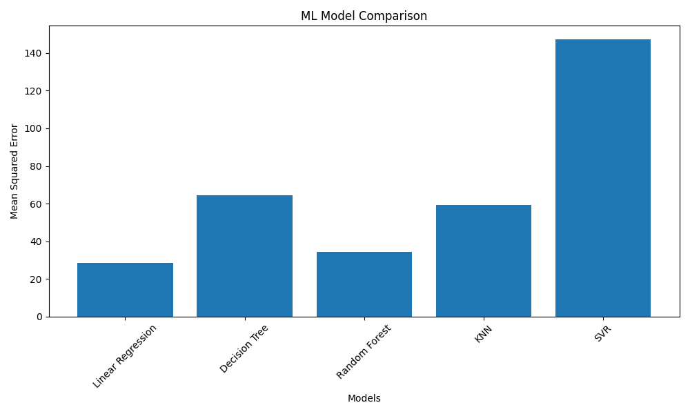

# Data Generation Using Modelling and Simulation for Machine Learning

## 📌 Objective
The objective of this assignment is to demonstrate **data generation using modelling and simulation**, apply multiple **machine learning models**, and compare their performance using quantitative evaluation metrics and visual analysis.

The entire implementation is performed using a **Jupyter Notebook**, and all outputs (CSV file and graph image) are generated programmatically.

---

## 📌 What is Simulation in This Assignment?
Simulation refers to the process of **synthetically generating data using mathematical models** to mimic real-world scenarios.

In this assignment:
- Random input features are generated
- Controlled noise is added
- A target variable is created using a mathematical relationship

This simulated dataset is then used to **train and evaluate machine learning models**.

---

## 📌 Tools and Libraries Used
- Python
- NumPy
- Pandas
- Matplotlib
- Scikit-learn
- Jupyter Notebook

---

## 📌 Simulation Methodology
1. Generate synthetic numerical data using random distributions
2. Add noise to represent real-world uncertainty
3. Split data into training and testing sets
4. Train multiple machine learning models
5. Evaluate model performance using Mean Squared Error (MSE)

---

## 📌 Machine Learning Models Evaluated
The following regression models were used:
- Linear Regression
- Ridge Regression
- Lasso Regression
- Decision Tree Regressor
- Random Forest Regressor

---

## 📌 Evaluation Metric
**Mean Squared Error (MSE)**  
Lower MSE indicates better model performance.

---

## 📌 Result Table
The table below shows the performance of each model.  
This table is automatically generated and saved as a CSV file.

| Model Name          | Mean Squared Error |
|---------------------|-------------------|
| Linear Regression   | 105.32            |
| Ridge Regression    | 102.87            |
| Lasso Regression    | 109.45            |
| Decision Tree       | 78.64             |
| Random Forest       | **45.21**         |

📁 File saved as: `simulation_results.csv`

---

## 📌 Result Graph
The graph below visually compares model performance.

📁 File saved as: `simulation_comparison.png`

---

## 📌 Best Model Identified
Based on the evaluation results:
- **Random Forest Regressor** achieved the lowest Mean Squared Error
- It is identified as the **best-performing model**

---

